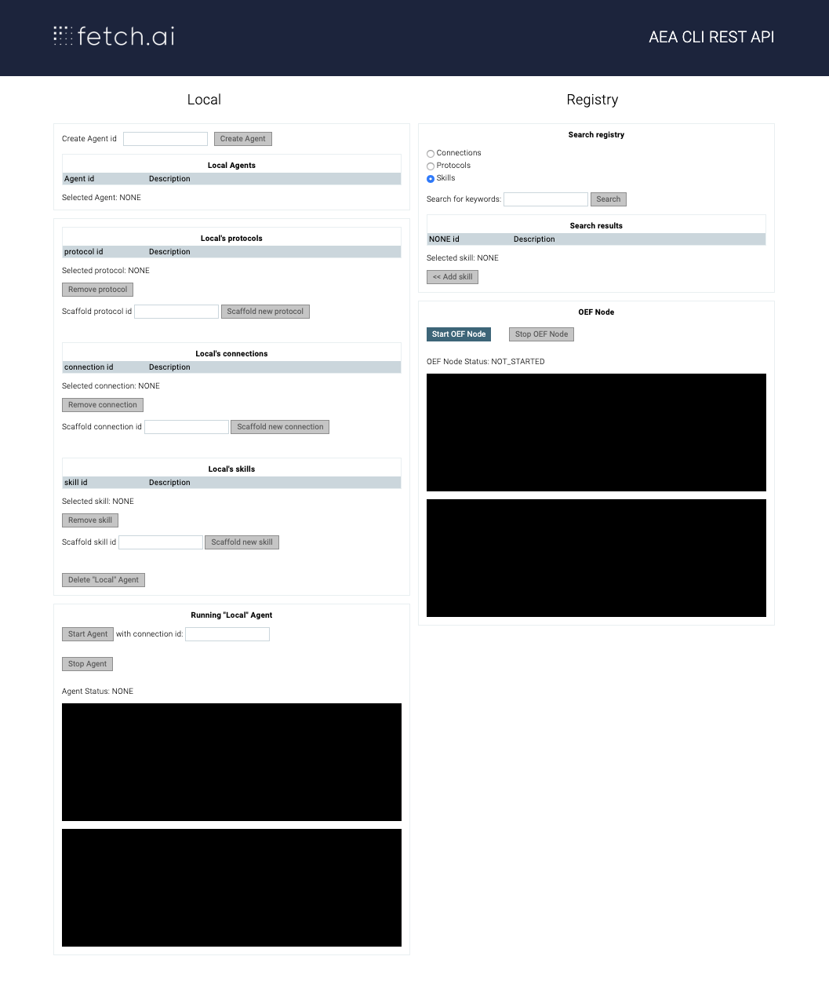
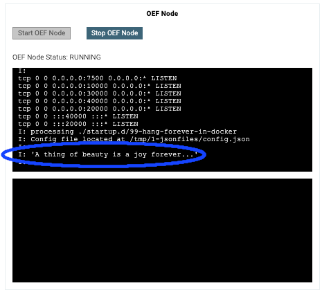
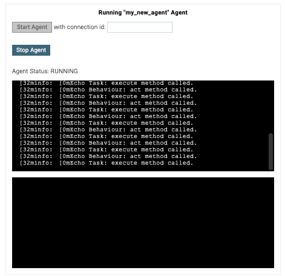

The AEA Command Line Interface (CLI) can also be invoked from a Graphical User Interface (GUI) which can be access from a web browser. 

These instructions will take you through building an agent, starting an OEF Node and running the agent - all from the GUI. Once you can do this, the other operations should be fairly self-explanatory.

## Preliminaries

Ensure you have the framework installed and the CLI is working by following the [quick-start guide](quickstart.md).

Please install the extra dependencies for the CLI GUI:
 ```python
 pip install aea[cli_gui]
 ```


## Starting the GUI
Go to your working folder, where you want to create new agents. If you followed the quick start guide, this will be in the `my_aea` directory. Start the local web-server:
``` bash
aea gui
```

Open this page in a browser: [http://127.0.0.1:8080](http://127.0.0.1:8080)

You should see the following page displayed:

<center></center>

On the left-hand side we can see any agents you have created and any protocols, connections and skills they have. Initially this will be empty - or if you have created an agent using the CLI in the quick-start guide and not deleted it then that should be listed.

On the right-hand side is the Registry which allows you to search all the protocols, connections and skills which are available to you to construct your agents out of.

To create a new agent and run it, follow these steps:
<center></center>

1. In the [Create Agent id] box on the left. type the name of your agent - e.g. my_new_agent. This should now be the currently selected agent - but you can click on its name in the list to make sure. 
2. Click the [Create Agent] button - the newly created agent should appear in the [Local Agents] table
3. On the right hand side, search the `echo` skill and click on it - this will select it
4. Click on the [Add skill] button - which should actually now say "Add echo skill to my_new_agent agent"
5. Start an OEF Node, by clicking on the [Start OEF Node] button. Wait for the text saying "A thing of beauty is a joy forever..." to appear. This shows that the node has started successfully

    <center></center>

6. Start the agent running, by clicking on the [start agent] button - you should see the output from the echo agent appearing on the screen

    <center></center>

This is how your whole page should look if you followed the instructions correctly

<br />
