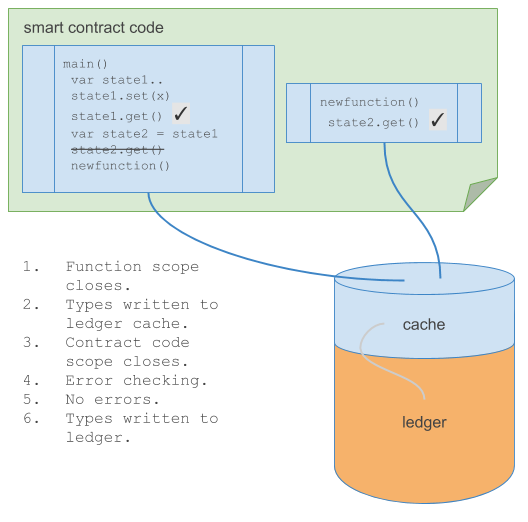

<h1>States</h1>

Smart contracts store data on the Fetch.AI distributed ledger using `State` and `ShardedState` data structures.

A `State` is declared as a `State<ValueType>(name : String)` where `name` is the unique memory location identifier for data residing on the ledger, like this:

``` c++
var myState = State<Int32>("account");
```

Now we can set a value on the `State` with `set()`:

``` c++
myState.set(100);
```

And retrieve the value with `get()`:
``` c++
myState.get();
```

The `State` constructor value inside the parentheses is a pointer to a memory location on the ledger. 

It takes a string, as above, or an `Address` type.

``` c++
function main()

    var account = Address("2ifr5dSFRAnXexBMC3HYEVp3JHSuz7KBPXWDRBV4xdFrqGy6R9");
    var myState = State<Int32>(account);
    myState.set(100);
    printLn("My state value = " + toString(myState.get()));

endfunction
```

In smart contract code, any number of `var` identifiers can point to the same `State` object on the ledger.

In the example below, `ownerState` and `contractState` point to the same memory location and therefore reference the same `State` object on the ledger.


``` c++
function main()

  var owner = Address("2ifr5dSFRAnXexBMC3HYEVp3JHSuz7KBPXWDRBV4xdFrqGy6R9");
  var ownerState = State<Int32>(owner);
  ownerState.set(333);
  printLn("My state value = " + toString(ownerState.get()));
  var contractState = State<Int32>(owner);
  // printLn("My state value = " + toString(contractState.get())); // runtime error: line 7: The state does not represent any value. 
  //The value has not been assigned and/or it does not exist in data storage.

endfunction
```

Attempting to print the value of the second `State` object generates an error. This is because the data set in `ownerState` has not yet been written to the intermediate cache or ledger storage, so when `contractState` tries to access it, it finds no value and this generates a runtime error.


## Writing `State` data to the ledger

The following is true for `State` variables with a `var` identifier.

Currently, `State` data is written to smart contract intermediate cache only after control has passed out of scope and the `destructor()` function has been called behind the scenes.

While identifiable `State` variables remain in function scope, data is written to an intermediate object cache mechanism at construction time. Within the same scope, such data is inaccessible to new `State` identifiers which do not explicitly call `set()`.

Once control reaches the end of the function, data is written to an intermediate ledger cache mechanism and is available throughout the contract.

Once control has reached the end of the contract, and no errors have arisen, the data is etched upon the ledger.

<center>



</center>


## Anonymous `State` types

Declaring an anonymous `State` type without a `var` name performs an immediate data write.

``` c++
function main()
  
  State<String>("account1").set("owner1_name");

  var account1 = State<String>("account1");
  printLn(account1.get());

endfunction
```

This is useful for `ShardedState` types which build up on immediate write anonymouse `State` types behind the scenes.


## Default values

Although it is possible to declare a `State` without a value, attempting to `get()` from such a `State` results in a runtime error.

``` c++
function main()

  State<Int32>("myNumber");
  // printLn(State<Int32>("myNumber").get());
  // The state does not represent any value. 
  // The value has not been assigned and/or it does not exist in data storage.

  var x = State<Int32>("myNumber2");
  // printLn(x.get());
  // The state does not represent any value. 
  // The value has not been assigned and/or it does not exist in data storage.

endfunction
```


## Passing States around

The following code shows the behaviour of `State` types as they are passed around functions.

`State` values are available to `get()` if the scope they were created in originally has closed.


``` c++
function main()

  var myState = State<Int32>("contract_owner_balance");
  myState.set(33);
  printLn(toString(myState.get()));
  // PRINTS 33

  change_state(myState);
  printLn(toString(myState.get()));
  // PRINTS 44

  var result = query();
  printLn(toString(result));
  // PRINTS 55

endfunction


function change_state(state : State<Int32>)

  // you can pass around a State parameter and get access to the original state
  var newState = state;
  newState.set(44);

  // a new state with pointer = "balance"
  var anotherState = State<Int32>("balance");
  anotherState.set(55);
  // all states from this function are written now
endfunction


function query() : Int32

  // accessing the State at pointer = "balance", a value out of scope 
  var myState = State<Int32>("balance");
  // returns the 55 set in change_state()
  return myState.get();

endfunction
```

Similarly, you cannot access a value set on a `State` if the function scope in which it was created is still open.

``` c++
function main()

    var state = State<Int32>("value");
    state.set(11);  
    printLn(state.get()); 

    var value1 = value();     
    printLn(toString(value1));
    // scope not yet closed therefore runtime error: 
    // The state does not represent any value. 
    // The value has not been assigned and/or it does not exist in data storage.

endfunction    

function value() : Int32      
    
    var state = State<Int32>("value");
    return state.get();
 
endfunction
```

## Common use

A common use for the `State` type is to represent account owner `Address` types with their respective balances. To this end, you can declare a `State` where the first parameter is an `Address` type.

In the code below we first create an `Address` type. We can then define the transaction sender account wrapped in a `State` type where the first parameter `from` is the `Address` we just created and the second parameter is the account balance in `UInt64`:

``` c++
function main()

  var from = Address("2ifr5dSFRAnXexBMC3HYEVp3JHSuz7KBPXWDRBV4xdFrqGy6R9");
  var from_account = State<UInt64>(from);
  from_account.set(100u64);

endfunction
```


<br/>


