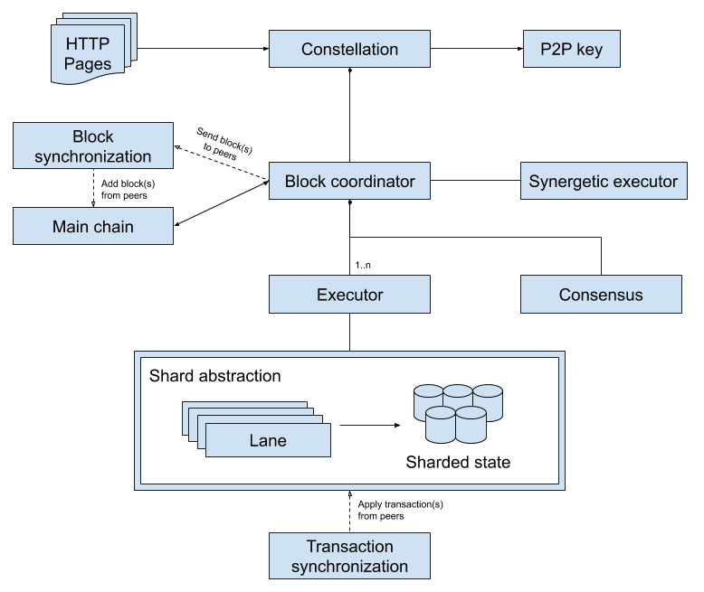

# Architecture

This section describes at a high level how the Fetch.ai ledger operates. We assume the reader is comfortable with concepts that underpin blockchain technology such as public key cryptography, consensus and smart contracts.

!!! note
    This is work in progress.

!!! note
    For an understanding of the whole Fetch architecture, please read [the Fetch.ai whitepaper](https://fetch.ai/wp-content/uploads/2019/10/technical-introduction.pdf).

The following diagram gives a high level overview of the components a node consists of. The entry point is the __Constellation__ application; every time a node is deployed in the network, an instance of this application is created. Please read [this section](running-a-constellation.md) for more information about how to run a node.

The __block coordinator__ inside each node is responsible for adding new blocks to its copy of the chain, while preserving its consistency. In order to do so, it advances along the chain to find the longest/heaviest branch, and drops the ones that are not. After reaching the heaviest block, the block coordinator asks the executor(s) and consensus for help to add a new block, which contains a set of transactions.

__Consensus__ is responsible for building a block that will be considered correct, e.g. with a timestamp greater than that of the heaviest block in the chain.

The __executor__ takes said block, iterates through all the transactions packed within it, and for each of them:

1. It determines if the transaction is valid, has paid the required fees, etc.
2. Since conceptually a transaction is a state change in blockchain, it updates the state accordingly.

Blocks are then exchanged between nodes via a __block synchronization protocol__. Consensus is also responsible for verifying that blocks received this way are correct.

## Sharding

The Fetch.ai ledger is unlike more traditional blockchain designs: instead of a single chain of truth, the ledger is sharded into parallel _lanes_. So even though the executor apparently has access to a continuous area of memory, in reality it is split across multiple processes, each of them representing a fraction of the state and the transactions.

This blockchain sharding design speeds up the network as contracts can execute concurrently, providing a solution to the blockchain scalability problem. Furthermore, by sharding the _world state_ in this way, transactions guarantee they only use certain resources, i.e. memory locations. Sharding is best done across multiple machines, to scale access and avoid resource locking.

As a consequence of this design, the _size_ of a block can vary by increasing or decreasing the number of shards. This allows the network to balance block sizes against economic incentives, for example.

## Wallet API

  
Note

  
This section is coming soon.

## P2P Service

  
Note

  
This section is coming soon.

 
