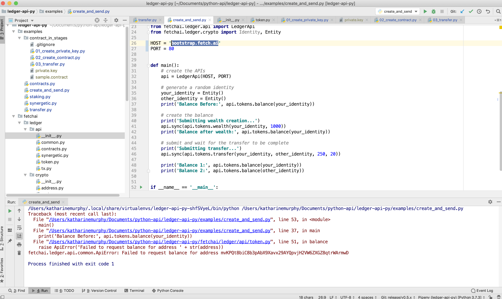

<h1>Executing smart contract code</h1>

## Locally

To run smart contract code on your local machine, first download, build, and run a ledger node. You can find out how to do that <a href="../.././getting-started/installation-mac/" target=_blank>here</a>.

If you have previously been running ledger constellation nodes, you should remove the databases as they will be incompatible with a fresh node.

```bash
rm *.db
```

Build the Python API libraries like this:

```bash
pip3 install -U fetchai-ledger-api
```

### Simple transfer example in Python

If you want to examine the code in more detail and look at some examples, you may prefer to clone or download the repo.

```bash
git clone https://github.com/fetchai/ledger-api-py.git
```

And run the installation script:

```bash
python3 ledger-api-py/setup.py install
```

In your favourite Python IDE, open the `create_and_send.py` script in the `examples` directory.

This script creates two `Entity` objects, sets a balance of 1000 tokens on `your_identity`, and makes a transfer to `other_identity`.

```python
from fetchai.ledger.api import LedgerApi
from fetchai.ledger.crypto import Identity, Entity

HOST = '127.0.0.1'
PORT = 8100


def main():
    # create the APIs
    api = LedgerApi(HOST, PORT)

    # generate a random identity
    your_identity = Entity()
    other_identity = Entity()
    print('Balance Before:', api.tokens.balance(your_identity))

    # create the balance
    print('Submitting wealth creation...')
    api.sync(api.tokens.wealth(your_identity, 1000))
    print('Balance after wealth:', api.tokens.balance(your_identity))

    # submit and wait for the transfer to be complete
    print('Submitting transfer...')
    api.sync(api.tokens.transfer(your_identity, other_identity, 250, 20))

    print('Balance 1:', api.tokens.balance(your_identity))
    print('Balance 2:', api.tokens.balance(other_identity))


if __name__ == '__main__':
    main()

```

<div class="admonition tip">
  <p class="admonition-title">Tip</p>
  <p>Make sure you have the correct port number for the running ledger node.</p>
</div>

You should see the following results when running the script.

```bash
Balance Before: 0
Submitting wealth creation...
Balance after wealth: 1000
Submitting transfer...
Balance 1: 749
Balance 2: 250

```

## Embedding contract code

Smart contract code is embedded into a Python script as a string.

The smart contract below resembles the `contracts.py` script in the examples folder, except the `State` definitions are in line with `etch` updates.

```python
from fetchai.ledger.api import LedgerApi
from fetchai.ledger.contract import SmartContract
from fetchai.ledger.crypto import Entity, Address

CONTRACT_TEXT = """
@init
function setup(owner : Address)
  var owner_balance = State<UInt64>(owner);
  owner_balance.set(1000000u64);
endfunction

@action
function transfer(from: Address, to: Address, amount: UInt64)

  // define the accounts
  var from_account = State<UInt64>(from);
  var to_account = State<UInt64>(to); // if new sets to 0u

  // Check if the sender has enough balance to proceed
  if (from_account.get(0u64) >= amount)

    // update the account balances
    from_account.set(from_account.get(0u64) - amount);
    to_account.set(to_account.get(0u64) + amount);
  endif

endfunction

@query
function balance(address: Address) : UInt64
    var account = State<UInt64>(address);
    return account.get(0u64);
endfunction

"""


```

From here, you can create a Python `SmartContract` type and feed it the contract string. Then deploy the contract with the Python `LedgerApi`.

The code below takes the `CONTRACT_TEXT` string above and deploys it to the ledger along with details of the contract owner and the fee.

```python
# create the smart contract
contract = SmartContract(CONTRACT_TEXT)

# deploy the contract to the network
api.sync(api.contracts.create(owner, contract, 2000))
```

## Public keys

Generate a public key for your smart contract, or `Agent`, with the `Entity` class in the Python API `crypto` package which generates a full private/public key object having a number of useful functions available on it.

Instantiate an `Entity` object and wrap it in an `Address` type to generate the public key.

```python
from fetchai.ledger.crypto import Entity, Address

entity = Entity()
entity_address = Address(entity)

print(entity_address)
```

There are many more functions available for `Entity` and `Address` which will be documented in due course.

## Test network

You can run the examples on our test network, replacing the hostname and port.

```bash
HOST = 'bootstrap.fetch.ai'
PORT = 80
```

<center></center>

However, you will need some FET tokens and an `Address`.

We show you how to get some test FET and set up the Fetch Wallet in the next section.

## Public network

!!! note
In development.

<br/>
