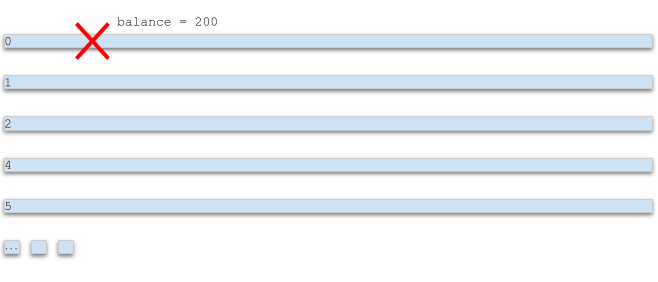
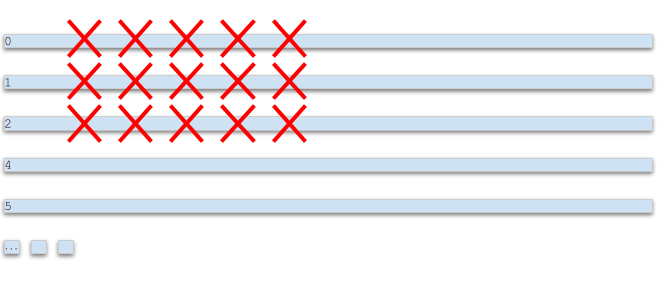

<h1>Memory</h1> 

A `State` type saves data to the shards that make up the ledger. There are 16 parallel shards on the ledger that accept permanent, irreversible storage. 

Developers have to pay to store data on ledger shards so they should take care when constructing `State` and `PersistentMap` types to avoid unnecessary fees. 

Ensuring that smart contract data is evenly spread across ledger shards is the most efficient and economical way to code and execute smart contracts in `etch`.

The trick is to ensure that `etch` code avoids taking up too much memory on a single shard or taking up too much memory on too many shards. 

It is possible to exceed `etch` imposed limits on data storage in which case an `etch` smart contract will fail. For example, aggregate functions may store too much data on too many shards on the ledger if coded inappropriately. Code like this can block other users and slow the network. Data fees will reflect this. 

You can visualise the ledger shards as a series of swim lanes. 

Data etches onto a shard depending on the smart contract design. The contents of a `State` map onto a single shard on the ledger. 

For example, `var myState = State<Int32>("balance", 200);` may map to a shard like this:

<center></center>

This is an economical way to manage memory on the ledger shards. However, there are scenarios in which data maps onto the ledger in an inefficient way. 

For example, given a voting function such as the one below, the code may aggregate the `State` variables tracking every vote in an inefficient manner:

``` c++

function main()

  vote();

endfunction

function vote()

    // declare and set brexit account
    
    var brexit = "nightmare business";

    var votes_for = State<Int32>(brexit, 0);
    var votes_against = State<Int32>(brexit, 0);
    var votes_total = State<Int32>(brexit, 0);
    var votes_sum = State<Int32>(brexit, 0);

    // ..and further along..

    if (true)
            // update the aggregate votes for
            votes_for.set(votes_for.get() + 1);
        else 
            // update the aggregate votes against
            votes_against.set(votes_against.get() + 1);
        endif

        // update the aggregate of total votes
        votes_sum.set(votes_total.get() + 1);

endfunction

```

Each time a `State` increments, the new data value takes up a new section on the shard.

The ledger shards could look something like this after this `vote()` function runs.

<center></center>

This is highly uneconomical. Every aggregate value for a single `State` accumulates upon a ledger shard. Furthermore, multiple `States` take up multiple shards. 

Data is chargeable per lane in order to disincentivize code like the above which can slow the network. The current maximum lanes allowed is 5.

There are better approaches to the voting problem. For example, by encapsulating the data with a `Map` like this:

!!! note 
	Coming soon: support for `Map` types.

``` c++
function main()

	var myMap : Map<String, Int32>;
    // myMap.insert("for", 0); // error: type 'Map<String, Int32>' has no member named 'insert'
    // myMap.insert("against", 0); // error: type 'Map<String, Int32>' has no member named 'insert'
    // myMap.insert("sum", 0); // error: type 'Map<String, Int32>' has no member named 'insert'

    // var myMapState = State<Map<String, Int32>>(myMap, null); // error: unable to find matching constructor for type/function 'State<Map<String, Int32>>'

endfunction

```
