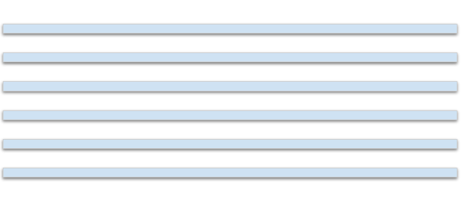

<h1>Introduction</h1>

A <a href="https://en.wikipedia.org/wiki/Smart_contract" target="_blank">smart contract</a> facilitates, verifies, and enforces a transaction between two or more parties on a distributed ledger or blockchain. 

A smart contract stores transaction data on the permanent and irreversible blockchain ledger and, on doing so, changes the state of the ledger. 

Smart contract programming languages are scripting languages specific to the cryptocurrency or platform, such Bitcoin's Script or Ethereum's Solidity. 

Fetch.AI smart contracts run on the `etch` virtual machine (VM) which is a logical computation layer for running smart contract code. The `etch` VM and smart contract code resides on every node of the distributed ledger.

Smart contracts can be used for voting, crowdfunding, auctions, multi-signature wallets, identity verification, and much more.

`etch` builds up smart contracts with `State` and `PersistentMap` data structures and the `Address` type which represents account owners and their balances. 

## The Ledger

Smart contract transactions are etched onto the distributed ledger, or blockchain, and are therefore permanent, traceable, and irreversible.

The Fetch.AI ledger is the blockchain foundation of the `etch` VM. Quick start instructions for spinning up a Fetch.AI ledger node are <a href="https://community.fetch.ai/getting-started/building-fetchai-ledger-node/develop" target="_blank">here</a>.

The Fetch.AI ledger is unlike more traditional blockchain designs. Instead of a single chain of truth, the Fetch.AI ledger is sharded into parallel lanes. 

Contracts can execute concurrently and the blockchain sharding design significantly speeds up the network.

## Fees

Fetch.AI charges developers for computation and storing data onto the ledger in a manner which incentivizes good coding practices.

Limit the fees paid for smart contract execution by using a random distribution of contract data on a shard and a minimum number of shard lanes.

Fees rise in a linear manner per number of shards used until the maximum number of shards is reached, at which point the fees start to go up exponentially.

!!! note 
	Coming soon: details of developer fee structures for smart contract data.